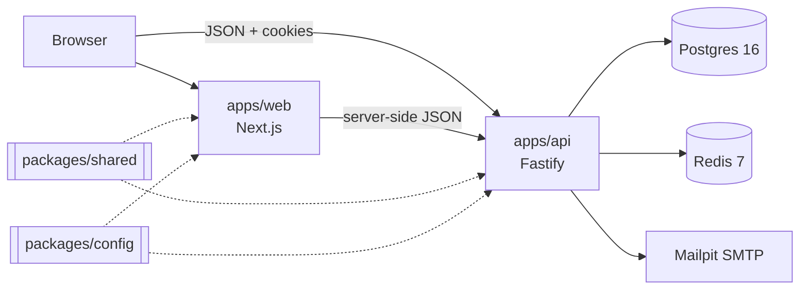

# Lumen Optics

An eyewear store: prescription glasses, sunglasses and computer glasses, with lenses explained in
plain language, honest pricing, and on-device virtual try-on.

This repository is a TypeScript monorepo with a Next.js storefront, a Fastify API and shared
packages. It runs fully locally with no paid services or API keys.

> **Status: Phase 4 (accounts).** Browse, choose lenses with live pricing, and buy as a guest or
> with an account: saved prescriptions and addresses, order history with invoices, cancellations,
> returns and "buy again", a synced, shareable wishlist, and password reset by email. Try-on
> arrives in Phase 5; see [the roadmap](#roadmap).

## Quick start

**Prerequisites:** Node 22.12+ (`nvm use` reads `.nvmrc`), pnpm 10 (`corepack enable`), Docker.

```bash
pnpm run setup   # install, .env, Docker services, migrate, seed, render product images
pnpm dev         # web on :3000, API on :4000 and the background worker, all with hot reload
```

> `pnpm setup` (without `run`) is a built-in pnpm command, so use `pnpm run setup` or
> `pnpm bootstrap`. See [ADR-006](docs/DECISIONS.md).
>
> The first run renders about 615 product images in headless Chromium, which takes several
> minutes; later runs only redraw what changed. Use `pnpm run setup --skip-assets` to skip it and
> run `pnpm setup:assets` later.

| What                     | Where                                   |
| ------------------------ | --------------------------------------- |
| Storefront               | http://localhost:3000                   |
| All frames               | http://localhost:3000/shop              |
| A product page           | http://localhost:3000/p/harbour         |
| Your bag                 | http://localhost:3000/cart              |
| Track an order           | http://localhost:3000/track             |
| System status            | http://localhost:3000/status            |
| Design system (dev only) | http://localhost:3000/dev/design-system |
| API                      | http://localhost:4000                   |
| API reference            | http://localhost:4000/docs              |
| Mailpit inbox            | http://localhost:8025                   |

## Scripts

| Command                                          | Does                                                                                 |
| ------------------------------------------------ | ------------------------------------------------------------------------------------ |
| `pnpm run setup`                                 | One-time setup. `--skip-install`, `--skip-docker` and `--skip-assets` are available. |
| `pnpm dev`                                       | Runs web, API and the background worker in watch mode.                               |
| `pnpm build`                                     | Production builds of every app.                                                      |
| `pnpm start`                                     | Runs the production builds.                                                          |
| `pnpm lint`                                      | ESLint (type-aware, React, a11y, Next.js).                                           |
| `pnpm typecheck`                                 | TypeScript in every package.                                                         |
| `pnpm test`                                      | Vitest in every package. API integration tests need `pnpm docker:up`.                |
| `pnpm test:coverage`                             | Tests with coverage thresholds.                                                      |
| `pnpm check`                                     | lint, typecheck, test, build. Run before pushing.                                    |
| `pnpm --filter @optical/web test:e2e`            | Playwright journeys, axe in both themes and measured INP (needs `pnpm build`).       |
| `pnpm --filter @optical/web budget:js`           | Initial JavaScript per page against the 170 kB gzipped budget.                       |
| `pnpm --filter @optical/web lhci`                | Lighthouse CI budgets (set `CHROME_PATH` if Chrome isn't found).                     |
| `pnpm format` / `format:check`                   | Prettier.                                                                            |
| `pnpm docker:up` / `docker:down` / `docker:logs` | Local services.                                                                      |
| `pnpm db:migrate`                                | Applies pending migrations (`prisma migrate deploy`).                                |
| `pnpm db:seed`                                   | Wipes and reseeds the demo data. Refuses to run in production.                       |
| `pnpm db:reset`                                  | Drops everything, re-migrates and reseeds.                                           |
| `pnpm db:studio`                                 | Opens Prisma Studio to browse the data.                                              |
| `pnpm render:images`                             | Renders product images. `--force` redraws all, `--only=<slug>` one product.          |
| `pnpm setup:assets`                              | Ensures Chromium is available, then renders images.                                  |

See [docs/TESTING.md](docs/TESTING.md) for what each suite covers and the performance budgets.

## Buying locally

1. Open a product (for example http://localhost:3000/p/harbour) and choose **Choose lenses**.
   Type a prescription (or upload a photo, or send it later), compare lens thickness, pick
   coatings and a tint, and add to the bag. **Frame only** skips lenses.
2. Check out with any email and a 10-digit mobile number; a PIN code such as `560038` fills in
   the city and state. Try `FREESHIP` or `WELCOME10` in the coupon field.
3. Pay with **Test payment**: on the order page choose to pay, decline or leave the payment
   pending (it settles after `MOCK_PENDING_SETTLE_SECONDS`). The outcome arrives as a signed
   webhook through the worker, as a real one would. **Cash on delivery** confirms at once.
4. Read the confirmation email at http://localhost:8025, and find the order again at
   http://localhost:3000/track with its number and your email.

## Accounts locally

Checkout never needs an account. To try one, sign in at http://localhost:3000/sign-in as
`asha@example.com` / `Asha#Lumen2026` (she has past orders), or create your own at `/register`
(anything in your bag comes with you). From **Account** you can:

- save prescriptions (each edit keeps the earlier version) and choose one when adding lenses,
- keep delivery addresses and pick one at checkout,
- open any order to download its invoice, cancel it before production, request a return after
  delivery (orders are marked delivered by staff; the admin arrives in Phase 6), or buy
  it again,
- change your password, download your data, or delete the account.

**Forgot your password?** sends a link to Mailpit (http://localhost:8025). After a guest order, the
confirmation page offers to create an account with one password.

Razorpay and Stripe switch on when their keys are set in `.env` (hosted payment pages; see
`.env.example`). Nothing is charged locally.

## Demo data

The seed is deterministic, so every machine gets the same data:

- 64 frames in 8 shapes (eyeglasses, sunglasses, computer glasses, kids) with 214 colour
  variants, real measurements and honest stock levels, plus 5 accessories
- the full lens catalogue: 5 lens types, 5 materials, 5 coatings in 3 packages, 5 tints, 7 rules
- 15 sample orders covering every order status, 107 reviews, 4 coupons (`WELCOME10`, `FREESHIP`,
  `FLAT300`, and the expired `MONSOON15`), 6 collections and 12 help articles

Demo accounts, for local development only:

| Role     | Email               | Password          |
| -------- | ------------------- | ----------------- |
| Admin    | `admin@example.com` | `Admin#Lumen2026` |
| Staff    | `staff@example.com` | `Staff#Lumen2026` |
| Customer | `asha@example.com`  | `Asha#Lumen2026`  |
| Customer | `rahul@example.com` | `Rahul#Lumen2026` |

## API

Browse the interactive reference at http://localhost:4000/docs. Conventions, error codes and
endpoint details are in [docs/API.md](docs/API.md). For example:

```bash
curl 'http://localhost:4000/v1/products?category=sunglasses&shape=aviator&sort=price-asc'
curl 'http://localhost:4000/v1/search/suggest?q=titanum'   # typo-tolerant
```

## Architecture



- `apps/web` is the storefront (and later the admin panel): server components by default, with
  client code kept under a 170 kB initial budget ([ADR-021](docs/DECISIONS.md))
- `apps/api` is the REST API, with OpenAPI generated from Zod schemas
- `packages/shared` holds the schemas, API contracts and money maths that both apps import
- `packages/config` holds brand, market (currency, tax, postal codes, shipping zones), feature flags, env validation, design tokens, and the lint and TypeScript presets
- `packages/shared` also holds the pricing engine, prescription validation, lens rules, the order state machine and the parametric frame geometry
- `scripts` holds setup, asset and product-image rendering tools

More in [docs/ARCHITECTURE.md](docs/ARCHITECTURE.md). Decisions are recorded in
[docs/DECISIONS.md](docs/DECISIONS.md), and assumptions in [docs/ASSUMPTIONS.md](docs/ASSUMPTIONS.md).

## Configuration

Every variable is documented in [`.env.example`](.env.example): its purpose, its default, whether
it is required, and which app reads it. Both apps read the root `.env` and validate it at startup.
A bad value stops the app with a message naming each problem.

Brand name, currency, tax rate, shipping thresholds and store policies live in
[`packages/config/src`](packages/config/src). Change them there, never in components.

## Troubleshooting

**`APP_SECRET: is required but not set`.** Run `pnpm run setup` again (it adds one to an existing
`.env` without touching anything else), or add `APP_SECRET=` followed by `openssl rand -hex 32`.

**Signed in, but the account page keeps sending you to sign in.** The shop and API must share a
site: `http://localhost:3000` with `http://localhost:4000` works; mixing `localhost` and
`127.0.0.1` does not, because the cookies belong to one host name. Use the same name for both
(`NEXT_PUBLIC_SITE_URL`, `NEXT_PUBLIC_API_URL`).

**"Too many incorrect passwords".** Five wrong passwords pause sign-in for that account for a
minute, doubling each time. Reset the password from the email in Mailpit, which lifts the pause.

**A test payment stays on "Waiting for the payment provider".** The worker delivers payment results
and emails; check that `pnpm dev` shows `Worker started`, and that Redis is running.

**Docker isn't running.** `pnpm run setup` stops and tells you so. Start Docker Desktop (or
`dockerd`) and run it again. To use your own Postgres 16 and Redis 7, set `DATABASE_URL` and
`REDIS_URL` in `.env` and run `pnpm run setup --skip-docker`.

**A port is busy.** Change `POSTGRES_PORT`, `REDIS_PORT` or `MAILPIT_*` in `.env`, update
`DATABASE_URL` / `REDIS_URL` to match, then run `pnpm docker:up`. For the apps, stop whatever is
using port 3000 or 4000, or change `API_PORT` (and `NEXT_PUBLIC_API_URL`).

**The status page says the API is unavailable.** Check that `pnpm dev` shows the API listening
on :4000, and that `API_INTERNAL_URL` (or `NEXT_PUBLIC_API_URL`) points at it.

**"Invalid environment" on startup.** The message lists every variable that is missing or
malformed. Compare your `.env` with `.env.example`.

**Product images fail to render.** Rendering needs Chrome or Chromium. `pnpm setup:assets`
downloads one through Playwright if none is found; behind a proxy, set `CHROMIUM_PATH` in `.env`
to an existing browser instead. The site works without the images; they only affect product
cards and galleries.

**API tests fail with a database error.** They need Postgres and Redis running (`pnpm docker:up`)
and use the separate `optical_test` database. See [docs/TESTING.md](docs/TESTING.md).

**Camera access.** Browsers allow the camera only on `https://` or `http://localhost`. If you open
the site at a LAN IP address (for example from a phone), try-on needs HTTPS. Try-on arrives in Phase 5.

## Roadmap

| Phase | Scope                                                                     | State |
| ----- | ------------------------------------------------------------------------- | ----- |
| 0     | Foundations: monorepo, tooling, tokens, env validation, health checks, CI | Done  |
| 1     | Data model, seed, catalogue/search/lens-quote API, pricing engine         | Done  |
| 2     | Storefront browsing: shell, home, listings, product pages, 3D viewer      | Done  |
| 3     | Lens configurator, cart, checkout, payments, emails                       | Done  |
| 4     | Auth and account area                                                     | Done  |
| 5     | Virtual try-on and Frame Finder                                           | Next  |
| 6     | Admin panel                                                               |       |
| 7     | Hardening and polish                                                      |       |
| 8     | Deployment readiness and handoff                                          |       |

## Licence

MIT. See [LICENSE](LICENSE). Third-party assets are listed in [docs/ASSETS.md](docs/ASSETS.md).
