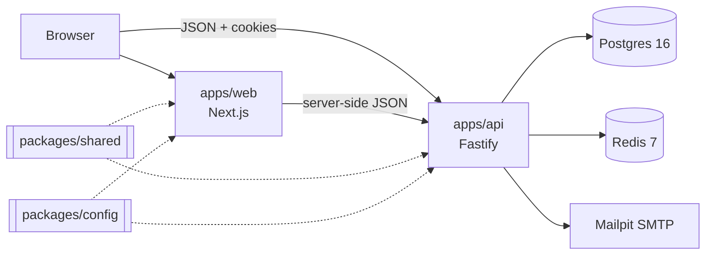

# Lumen Optics

An eyewear store: prescription glasses, sunglasses and computer glasses, with lenses explained in
plain language, honest pricing, and on-device virtual try-on.

This repository is a TypeScript monorepo with a Next.js storefront, a Fastify API and shared
packages. It runs fully locally with no paid services or API keys.

> **Status: Phase 0 (foundations).** Tooling, design tokens, the API skeleton with health checks,
> local services and CI are in place. The storefront, catalogue and checkout arrive in later
> phases; see [the roadmap](#roadmap).

## Quick start

**Prerequisites:** Node 22.12+ (`nvm use` reads `.nvmrc`), pnpm 10 (`corepack enable`), Docker.

```bash
pnpm run setup   # install, create .env, start Postgres/Redis/Mailpit and wait until healthy
pnpm dev         # web on :3000, API on :4000, both with hot reload
```

> `pnpm setup` (without `run`) is a built-in pnpm command, so use `pnpm run setup` or
> `pnpm bootstrap`. See [ADR-006](docs/DECISIONS.md).

| What                     | Where                                   |
| ------------------------ | --------------------------------------- |
| Storefront               | http://localhost:3000                   |
| System status            | http://localhost:3000/status            |
| Design system (dev only) | http://localhost:3000/dev/design-system |
| API                      | http://localhost:4000                   |
| API reference            | http://localhost:4000/docs              |
| Mailpit inbox            | http://localhost:8025                   |

## Scripts

| Command                                          | Does                                                                  |
| ------------------------------------------------ | --------------------------------------------------------------------- |
| `pnpm run setup`                                 | One-time setup. `--skip-install` and `--skip-docker` are available.   |
| `pnpm dev`                                       | Runs web and API in watch mode.                                       |
| `pnpm build`                                     | Production builds of every app.                                       |
| `pnpm start`                                     | Runs the production builds.                                           |
| `pnpm lint`                                      | ESLint (type-aware, React, a11y, Next.js).                            |
| `pnpm typecheck`                                 | TypeScript in every package.                                          |
| `pnpm test`                                      | Vitest in every package. API integration tests need `pnpm docker:up`. |
| `pnpm test:coverage`                             | Tests with coverage thresholds.                                       |
| `pnpm check`                                     | lint, typecheck, test, build. Run before pushing.                     |
| `pnpm format` / `format:check`                   | Prettier.                                                             |
| `pnpm docker:up` / `docker:down` / `docker:logs` | Local services.                                                       |

Database, seed, e2e and image-rendering scripts (`db:migrate`, `db:seed`, `test:e2e`,
`render:images`) are added in the phases that introduce them.

## Architecture



- `apps/web` is the storefront (and later the admin panel)
- `apps/api` is the REST API, with OpenAPI generated from Zod schemas
- `packages/shared` holds the schemas, API contracts and money maths that both apps import
- `packages/config` holds brand, market (currency, tax, postal codes), feature flags, env validation, design tokens, and the lint and TypeScript presets

More in [docs/ARCHITECTURE.md](docs/ARCHITECTURE.md). Decisions are recorded in
[docs/DECISIONS.md](docs/DECISIONS.md), and assumptions in [docs/ASSUMPTIONS.md](docs/ASSUMPTIONS.md).

## Configuration

Every variable is documented in [`.env.example`](.env.example): its purpose, its default, whether
it is required, and which app reads it. Both apps read the root `.env` and validate it at startup.
A bad value stops the app with a message naming each problem.

Brand name, currency, tax rate, shipping thresholds and store policies live in
[`packages/config/src`](packages/config/src). Change them there, never in components.

## Troubleshooting

**Docker isn't running.** `pnpm run setup` stops and tells you so. Start Docker Desktop (or
`dockerd`) and run it again. To use your own Postgres 16 and Redis 7, set `DATABASE_URL` and
`REDIS_URL` in `.env` and run `pnpm run setup --skip-docker`.

**A port is busy.** Change `POSTGRES_PORT`, `REDIS_PORT` or `MAILPIT_*` in `.env`, update
`DATABASE_URL` / `REDIS_URL` to match, then run `pnpm docker:up`. For the apps, stop whatever is
using port 3000 or 4000, or change `API_PORT` (and `NEXT_PUBLIC_API_URL`).

**The status page says the API is unavailable.** Check that `pnpm dev` shows the API listening
on :4000, and that `API_INTERNAL_URL` (or `NEXT_PUBLIC_API_URL`) points at it.

**"Invalid environment" on startup.** The message lists every variable that is missing or
malformed. Compare your `.env` with `.env.example`.

**Camera access.** Browsers allow the camera only on `https://` or `http://localhost`. If you open
the site at a LAN IP address (for example from a phone), try-on needs HTTPS. Try-on arrives in Phase 5.

## Roadmap

| Phase | Scope                                                                     | State |
| ----- | ------------------------------------------------------------------------- | ----- |
| 0     | Foundations: monorepo, tooling, tokens, env validation, health checks, CI | Done  |
| 1     | Data model, seed, catalogue/search/lens-quote API, pricing engine         | Next  |
| 2     | Storefront browsing: shell, home, listings, product pages, 3D viewer      |       |
| 3     | Lens configurator, cart, checkout, payments, emails                       |       |
| 4     | Auth and account area                                                     |       |
| 5     | Virtual try-on and Frame Finder                                           |       |
| 6     | Admin panel                                                               |       |
| 7     | Hardening and polish                                                      |       |
| 8     | Deployment readiness and handoff                                          |       |

## Licence

MIT. See [LICENSE](LICENSE). Third-party assets are listed in [docs/ASSETS.md](docs/ASSETS.md).
