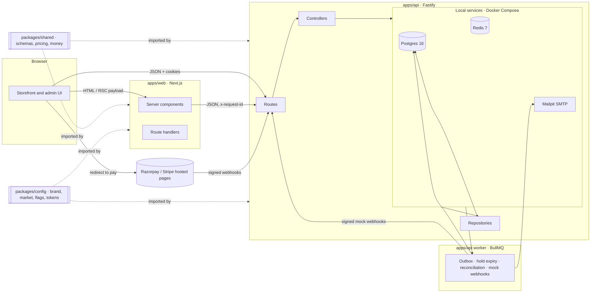
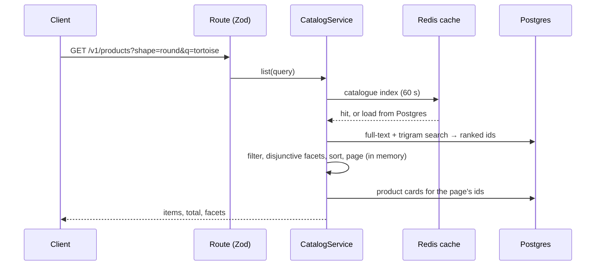
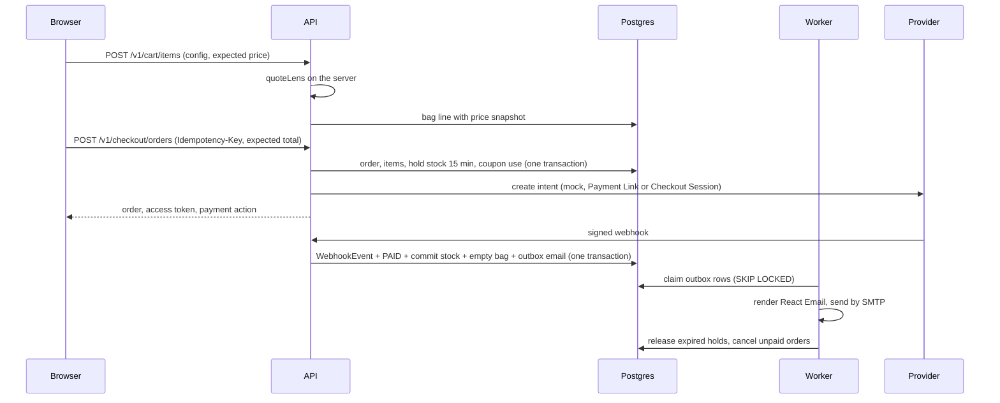

# Architecture

## Overview



## Packages

| Path              | Purpose                                                                                                                                                                          |
| ----------------- | -------------------------------------------------------------------------------------------------------------------------------------------------------------------------------- |
| `apps/web`        | Next.js App Router storefront and (from Phase 6) admin UI. Server components by default; client components only for interactivity.                                               |
| `apps/api`        | Fastify REST API, versioned under `/v1`. OpenAPI generated from Zod schemas and served at `/docs`.                                                                               |
| `packages/shared` | Everything client and server must agree on: Zod schemas, API contracts, money maths, and (from Phase 1) the pricing engine and prescription validation. Pure TypeScript, no I/O. |
| `packages/config` | Brand, market (currency, tax, postal codes, policies), feature flags, env validation helpers, design tokens, and shared ESLint/TypeScript/Tailwind configuration.                |

## API layering

`routes → controllers → services → repositories`

- **Routes** declare the HTTP shape: method, path, Zod schemas for params, body and responses.
- **Controllers** translate between HTTP and domain calls. No business rules.
- **Services** hold business rules and orchestrate repositories and providers. Unit-testable with fakes.
- **Repositories** are the only layer that talks to Prisma.

External dependencies (database, Redis, payments, email, storage) sit behind interfaces and are
injected into `buildApp`, so tests swap them for in-memory fakes. See `src/infra/probes.ts` for the
first example.

## Catalogue reads



Search relevance comes from Postgres; everything else runs over a compact cached index of published
products (ADR-014). The cache fails open: if Redis is down, reads go to Postgres and a warning is
logged.

## Lens pricing

The web app and the API run the same `quoteLens` and `priceOrder` from `packages/shared`. The web
app shows live prices; the API recomputes on every write and trusts only its own result. Lens
choices are stored as an immutable snapshot on cart and order items, so later catalogue changes
never alter a placed order.

## Buying



- **Guest sessions:** an opaque cookie, hashed server-side; bags, uploads and their use are tied
  to it (ADR-028).
- **Payments:** a `PaymentProvider` per method, registered only when configured. The order page
  learns the outcome by polling the API, which learns it only from verified webhooks or a status
  check (ADR-031).
- **Stock:** `available = onHand − reserved`; holds and commits are conditional updates with a
  database check constraint behind them (ADR-030).
- **Emails:** transactional outbox, sent by the worker with retries (ADR-034).
- **Uploads:** sniffed, stripped, scanned, private, signed links (ADR-035).

## Accounts

```mermaid
sequenceDiagram
  participant B as Browser
  participant A as API
  participant D as Postgres
  B->>A: POST /v1/auth/login (email, password)
  A->>D: check lockout, verify Argon2id hash
  A->>D: merge guest bag and uploads, new refresh family (one transaction)
  A-->>B: lo_access (JWT, 15 min), lo_refresh (/v1/auth, 30 days), lo_auth hint
  B->>A: GET /v1/cart (lo_access)
  A->>D: is the token's family still live?
  A-->>B: the account's bag
  Note over B,A: 15 minutes later
  B->>A: GET /v1/cart
  A-->>B: 401 UNAUTHENTICATED
  B->>A: POST /v1/auth/refresh (lo_refresh)
  A->>D: lock token, replace it in the family (reuse → revoke family)
  A-->>B: new cookies; the request is repeated
```

- **Owner:** every bag, upload and order request acts for an _owner_: the signed-in customer,
  or else the guest session. Orders also accept their access token, so guests keep their links
  (ADR-040, ADR-042).
- **Tokens:** ADR-037 and ADR-038. **Lockout:** ADR-039.
- **Account data:** saved addresses, versioned prescriptions (ADR-041), wishlist with a share
  token, order history; export and deletion in `account.service.ts`.
- **Web:** account pages render in the browser from the API; the header shows "Account"
  without a request thanks to the `lo_auth` hint cookie.

## Request tracing

The web server sends `x-request-id: web-<uuid>` on every API call. The API reuses a safe incoming
ID (8 to 128 characters of `[A-Za-z0-9._:-]`), otherwise mints a UUID, echoes it in the response
header, adds it to every log line as `requestId`, and includes it in every error body so customers
can quote it to support.

## Errors

Every API error uses one envelope, `{ error: { code, message, details?, requestId } }`, with codes
from `packages/shared/src/api/errors.ts`. See [API.md](./API.md).

## Configuration

12-factor: everything comes from environment variables, validated with Zod at startup
(`packages/config/src/env.ts`). The API fails fast with a list of every problem; the web server
does the same in `instrumentation.ts`. Business settings that are not secrets (currency, tax rate,
shipping thresholds) live in `packages/config` and become admin-editable in Phase 6.

## Health

| Endpoint           | Meaning                                                                                                          |
| ------------------ | ---------------------------------------------------------------------------------------------------------------- |
| `GET api:/healthz` | Liveness. The process is up. Never touches dependencies.                                                         |
| `GET api:/readyz`  | Readiness. `ready`, `degraded` (Redis down, still serving, HTTP 200) or `unavailable` (database down, HTTP 503). |
| `GET web:/healthz` | Liveness of the Next.js server.                                                                                  |
| `web:/status`      | Human-readable status page built from the API probes.                                                            |

## The storefront (`apps/web`)

| Path                     | What lives there                                                                                                                                                      |
| ------------------------ | --------------------------------------------------------------------------------------------------------------------------------------------------------------------- |
| `src/app/(store)`        | Store routes: home, `/shop`, `/shop/[category]`, `/collections/[slug]`, `/search`, `/p/[slug]`, wishlist, compare, help and legal pages. They share the shell layout. |
| `src/components/shell`   | Header (disclosure mega menu, search launcher, mobile menu), announcement bar, footer, mobile tab bar.                                                                |
| `src/components/listing` | Filters, toolbar and the server-rendered listing; the URL is the state (ADR-020).                                                                                     |
| `src/components/pdp`     | Gallery, 3D viewer, purchase panel, fit guide, delivery estimate, reviews.                                                                                            |
| `src/components/home`    | Hero (photo, then an optional 3D upgrade), lens story, face shapes, store promises.                                                                                   |
| `src/lib/catalog.ts`     | Server-only data access: validated API calls through Next's fetch cache.                                                                                              |
| `src/lib/browser-api.ts` | The few calls made from the browser (search suggestions, wishlist, compare).                                                                                          |
| `src/content/legal`      | Policy pages as typed content built from settings (ADR-027).                                                                                                          |

Server components render everything they can. Client components are limited to interaction, and
anything not needed for the first paint (dialogs, the search palette, toasts, three.js) loads on
demand, keeping each page within the 170 kB initial JavaScript budget (ADR-021).
