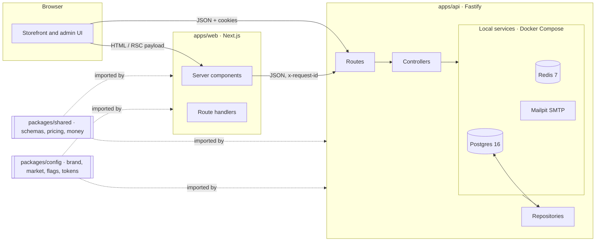

# Architecture

## Overview

## Packages

| Path              | Purpose                                                                                                                                                                          |
| ----------------- | -------------------------------------------------------------------------------------------------------------------------------------------------------------------------------- |
| `apps/web`        | Next.js App Router storefront and (from Phase 6) admin UI. Server components by default; client components only for interactivity.                                               |
| `apps/api`        | Fastify REST API, versioned under `/v1`. OpenAPI generated from Zod schemas and served at `/docs`.                                                                               |
| `packages/shared` | Everything client and server must agree on: Zod schemas, API contracts, money maths, and (from Phase 1) the pricing engine and prescription validation. Pure TypeScript, no I/O. |
| `packages/config` | Brand, market (currency, tax, postal codes, policies), feature flags, env validation helpers, design tokens, and shared ESLint/TypeScript/Tailwind configuration.                |

## API layering

`routes → controllers → services → repositories`

- **Routes** declare the HTTP shape: method, path, Zod schemas for params, body and responses.
- **Controllers** translate between HTTP and domain calls. No business rules.
- **Services** hold business rules and orchestrate repositories and providers. Unit-testable with fakes.
- **Repositories** are the only layer that talks to Prisma.

External dependencies (database, Redis, payments, email, storage) sit behind interfaces and are
injected into `buildApp`, so tests swap them for in-memory fakes. See `src/infra/probes.ts` for the
first example.

## Request tracing

The web server sends `x-request-id: web-<uuid>` on every API call. The API reuses a safe incoming
ID (8 to 128 characters of `[A-Za-z0-9._:-]`), otherwise mints a UUID, echoes it in the response
header, adds it to every log line as `requestId`, and includes it in every error body so customers
can quote it to support.

## Errors

Every API error uses one envelope, `{ error: { code, message, details?, requestId } }`, with codes
from `packages/shared/src/api/errors.ts`. See [API.md](./API.md).

## Configuration

12-factor: everything comes from environment variables, validated with Zod at startup
(`packages/config/src/env.ts`). The API fails fast with a list of every problem; the web server
does the same in `instrumentation.ts`. Business settings that are not secrets (currency, tax rate,
shipping thresholds) live in `packages/config` and become admin-editable in Phase 6.

## Health

| Endpoint           | Meaning                                                                                                          |
| ------------------ | ---------------------------------------------------------------------------------------------------------------- |
| `GET api:/healthz` | Liveness. The process is up. Never touches dependencies.                                                         |
| `GET api:/readyz`  | Readiness. `ready`, `degraded` (Redis down, still serving, HTTP 200) or `unavailable` (database down, HTTP 503). |
| `GET web:/healthz` | Liveness of the Next.js server.                                                                                  |
| `web:/status`      | Human-readable status page built from the API probes.                                                            |
